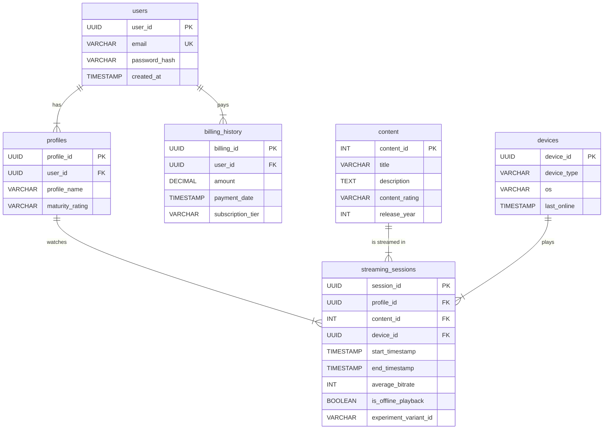

# DVD to Streaming Data Infrastructure Migration

## Project Overview
This project simulates the complete Data Engineering and ETL (Extract, Transform, Load) pipeline required to migrate a legacy physical DVD rental business (based on the Sakila database) into a modern, cloud-native digital streaming platform. 

It features a containerized PostgreSQL database, an idempotent schema design, and an isolated Python analytics environment to process simulated streaming telemetry (A/B testing, bitrates, and device tracking).

## Tech Stack
* **OS:** Arch Linux (Native Development)
* **Infrastructure:** Docker & Docker Compose
* **Database:** PostgreSQL
* **Data Transformation:** SQL (DDL/DML)
* **Analytics & Python:** Python 3 (venv), Jupyter Notebooks, Pandas, SQLAlchemy

## Data Migration & Mapping Plan
To pivot from physical rentals to digital streams, the legacy Sakila schema was refactored. 

| Old Sakila Table | Action | New Streaming Table | Transformation Notes |
| :--- | :--- | :--- | :--- |
| `customer` | **Split** | `users` & `profiles` | Mapped one paying user to multiple viewing profiles. |
| `film` | **Rename** | `content` | Dropped physical columns (replacement cost). Kept metadata. |
| `rental` | **Transform** | `streaming_sessions` | Physical 3-day rentals transformed into digital viewing sessions. Timestamps mapped; synthetic telemetry (bitrate) injected. |
| `payment` | **Rename** | `billing_history` | Shifted logic from pay-per-rental to subscription tiers. |
| `inventory` | **Drop** | N/A | Digital streams are infinite; physical tracking deprecated. |
| **N/A (New)** | **Create** | `devices` | Tracks hardware (Smart TV, Mobile, Drone) used for streaming. |

---

## Logical Relational Schema
### `users` (Replaces `customer`)
| Column Name | Data Type | Keys/Constraints | Description |
| :--- | :--- | :--- | :--- |
| `user_id` | UUID | **PK** | Unique account identifier |
| `email` | VARCHAR | **UNIQUE**, NOT NULL | Login email address |
| `password_hash` | VARCHAR | NOT NULL | Encrypted password |
| `created_at` | TIMESTAMP | NOT NULL | Account creation date |

### `streaming_sessions` (Replaces `rental`)
| Column Name | Data Type | Keys/Constraints | Description |
| :--- | :--- | :--- | :--- |
| `session_id` | UUID | **PK** | Unique session identifier |
| `profile_id` | UUID | **FK** -> `profiles`, NOT NULL | Who is watching |
| `content_id` | INT | **FK** -> `content`, NOT NULL | What they are watching |
| `device_id` | UUID | **FK** -> `devices`, NOT NULL | Hardware used |
| `start_timestamp` | TIMESTAMP | NOT NULL | When stream started |
| `end_timestamp` | TIMESTAMP | NULL | When stream ended |
| `average_bitrate` | INT | NULL | Quality metric (e.g., 1500) |
| `is_offline_playback`| BOOLEAN | NOT NULL (Default: FALSE) | Was it downloaded? |
| `experiment_variant_id`| VARCHAR | NULL | A/B testing group (A, B, Control) |


## Entity-Relationship Diagram


## Logical Schema & DDL

To enforce strict data integrity and optimize for analytical workloads, the database was built using the following complete Data Definition Language (DDL) script. 

**Key Architectural Decisions:**
* **Cascading Deletes:** Enforced `ON DELETE CASCADE` so that if a user is deleted, their associated profiles, billing, and sessions are automatically purged (preventing orphaned records).
* **Check Constraints:** Added business logic directly into the schema (e.g., `end_timestamp >= start_timestamp`, `average_bitrate > 0`).
* **Analytical Indexes:** Pre-indexed foreign keys, timestamps, and the A/B test variant columns to reduce query execution time from minutes to milliseconds during heavy aggregations.

```sql

DROP TABLE IF EXISTS streaming_sessions CASCADE;
DROP TABLE IF EXISTS billing_history CASCADE;
DROP TABLE IF EXISTS profiles CASCADE;
DROP TABLE IF EXISTS devices CASCADE;
DROP TABLE IF EXISTS content CASCADE;
DROP TABLE IF EXISTS users CASCADE;


CREATE TABLE users (
    user_id UUID PRIMARY KEY,
    email VARCHAR(255) UNIQUE NOT NULL,
    password_hash VARCHAR(255) NOT NULL,
    created_at TIMESTAMP NOT NULL DEFAULT CURRENT_TIMESTAMP
);

CREATE TABLE profiles (
    profile_id UUID PRIMARY KEY,
    user_id UUID NOT NULL,
    profile_name VARCHAR(100) NOT NULL,
    maturity_rating VARCHAR(10) CHECK (maturity_rating IN ('G', 'PG', 'PG-13', 'R', 'NC-17', 'TV-MA', 'TV-14', 'TV-PG', 'TV-Y7', 'TV-Y')),
    CONSTRAINT fk_user FOREIGN KEY (user_id) REFERENCES users(user_id) ON DELETE CASCADE
);

CREATE TABLE billing_history (
    billing_id UUID PRIMARY KEY,
    user_id UUID NOT NULL,
    amount DECIMAL(10, 2) NOT NULL CHECK (amount >= 0),
    payment_date TIMESTAMP NOT NULL DEFAULT CURRENT_TIMESTAMP,
    subscription_tier VARCHAR(50) NOT NULL CHECK (subscription_tier IN ('Basic', 'Standard', 'Premium')),
    CONSTRAINT fk_user_billing FOREIGN KEY (user_id) REFERENCES users(user_id) ON DELETE CASCADE
);

CREATE TABLE content (
    content_id INT PRIMARY KEY,
    title VARCHAR(255) NOT NULL,
    description TEXT,
    content_rating VARCHAR(10),
    release_year INT CHECK (release_year >= 1800 AND release_year <= 2100)
);

CREATE TABLE devices (
    device_id UUID PRIMARY KEY,
    device_type VARCHAR(50) NOT NULL,
    os VARCHAR(50) NOT NULL,
    last_online TIMESTAMP
);

CREATE TABLE streaming_sessions (
    session_id UUID PRIMARY KEY,
    profile_id UUID NOT NULL,
    content_id INT NOT NULL,
    device_id UUID NOT NULL,
    start_timestamp TIMESTAMP NOT NULL,
    end_timestamp TIMESTAMP,
    average_bitrate INT CHECK (average_bitrate > 0),             
    is_offline_playback BOOLEAN NOT NULL DEFAULT FALSE,     
    experiment_variant_id VARCHAR(50),
    
    CONSTRAINT fk_profile FOREIGN KEY (profile_id) REFERENCES profiles(profile_id) ON DELETE CASCADE,
    CONSTRAINT fk_content FOREIGN KEY (content_id) REFERENCES content(content_id) ON DELETE CASCADE,
    CONSTRAINT fk_device FOREIGN KEY (device_id) REFERENCES devices(device_id) ON DELETE SET NULL,
    CONSTRAINT chk_time_logic CHECK (end_timestamp >= start_timestamp)
);


CREATE INDEX idx_sessions_start_time ON streaming_sessions(start_timestamp);
CREATE INDEX idx_sessions_variant ON streaming_sessions(experiment_variant_id);
CREATE INDEX idx_sessions_profile ON streaming_sessions(profile_id);
CREATE INDEX idx_sessions_content ON streaming_sessions(content_id);
CREATE INDEX idx_sessions_device ON streaming_sessions(device_id);

```

## Analytics Design & Example Queries

Raw telemetry data is too massive to query directly for real-time dashboards. To optimize reporting, we implemented a daily aggregation ETL pipeline, followed by advanced analytical views.

### 1. Summary Table Architecture & ETL
To prevent business intelligence (BI) tools from querying millions of raw rows, we aggregate the telemetry nightly into a `daily_content_metrics` fact table.

**DDL for Summary Table:**
```sql
CREATE TABLE daily_content_metrics (
    report_date DATE NOT NULL,
    content_id INT NOT NULL,
    total_views INT DEFAULT 0,
    total_watch_seconds BIGINT DEFAULT 0,
    average_bitrate INT,
    PRIMARY KEY (report_date, content_id),
    CONSTRAINT fk_daily_content FOREIGN KEY (content_id) REFERENCES content(content_id)
);
```

#### ETL Pipeline Query (Nightly Aggregation):
```sql

-- Inserts aggregated daily stats, updating existing records if rerun (Idempotent)
INSERT INTO daily_content_metrics (report_date, content_id, total_views, total_watch_seconds, average_bitrate)
SELECT 
    DATE(start_timestamp) AS report_date,
    content_id,
    COUNT(session_id) AS total_views,
    SUM(EXTRACT(EPOCH FROM (end_timestamp - start_timestamp))) AS total_watch_seconds,
    AVG(average_bitrate)::INT AS average_bitrate
FROM streaming_sessions
WHERE end_timestamp IS NOT NULL
GROUP BY DATE(start_timestamp), content_id
ON CONFLICT (report_date, content_id) 
DO UPDATE SET 
    total_views = EXCLUDED.total_views,
    total_watch_seconds = EXCLUDED.total_watch_seconds,
    average_bitrate = EXCLUDED.average_bitrate;
```
### 2. Core Business Analytics Queries

#### Query 1: Daily Active Users (DAU) & Total Watch Time
Tracks platform engagement day-over-day.

```sql
SELECT 
    DATE(ss.start_timestamp) AS streaming_date,
    COUNT(DISTINCT p.user_id) AS daily_active_users,
    SUM(EXTRACT(EPOCH FROM (ss.end_timestamp - ss.start_timestamp))/3600) AS total_hours_watched
FROM streaming_sessions ss
JOIN profiles p ON ss.profile_id = p.profile_id
GROUP BY DATE(ss.start_timestamp)
ORDER BY streaming_date DESC;
```

#### Query 2: Content Retention (Average Watch Time by Content)
Identifies which content holds viewer attention the longest.


```sql
SELECT 
    c.title,
    c.content_rating,
    COUNT(ss.session_id) AS total_plays,
    AVG(EXTRACT(EPOCH FROM (ss.end_timestamp - ss.start_timestamp))/60)::INT AS avg_watch_minutes
FROM streaming_sessions ss
JOIN content c ON ss.content_id = c.content_id
WHERE ss.end_timestamp IS NOT NULL
GROUP BY c.title, c.content_rating
ORDER BY avg_watch_minutes DESC
LIMIT 10;
```

#### Query 3: Churn Risk Indicator
Finds paying users who haven't streamed anything in the last 30 days.

```sql
WITH LastUserStream AS (
    SELECT 
        p.user_id,
        MAX(ss.start_timestamp) AS last_stream_date
    FROM profiles p
    LEFT JOIN streaming_sessions ss ON p.profile_id = ss.profile_id
    GROUP BY p.user_id
)
SELECT 
    u.email,
    b.subscription_tier,
    lus.last_stream_date,
    EXTRACT(DAY FROM (CURRENT_TIMESTAMP - lus.last_stream_date)) AS days_since_last_stream
FROM users u
JOIN LastUserStream lus ON u.user_id = lus.user_id
JOIN billing_history b ON u.user_id = b.user_id
WHERE lus.last_stream_date < CURRENT_TIMESTAMP - INTERVAL '30 days'
   OR lus.last_stream_date IS NULL;
```


#### Query 4: Device Ecosystem Distribution
Analyzes what hardware the user base relies on to guide engineering priorities.


```sql
SELECT 
    d.os,
    d.device_type,
    COUNT(DISTINCT ss.profile_id) AS unique_profiles,
    COUNT(ss.session_id) AS total_streams
FROM streaming_sessions ss
JOIN devices d ON ss.device_id = d.device_id
GROUP BY d.os, d.device_type
ORDER BY total_streams DESC;
```


#### Query 5: A/B Test Telemetry Evaluation
Evaluates the impact of new video player algorithms on streaming quality.

```sql
SELECT 
    experiment_variant_id,
    COUNT(session_id) AS total_sessions,
    AVG(average_bitrate)::INT AS avg_variant_bitrate,
    SUM(CASE WHEN is_offline_playback = TRUE THEN 1 ELSE 0 END) AS offline_downloads
FROM streaming_sessions
WHERE experiment_variant_id IS NOT NULL
GROUP BY experiment_variant_id;
```

#### Query 6: Recommendation-Ready Co-Watch Matrix
Finds content correlation: "Users who watched Content A also watched Content B."

```sql
SELECT 
    c1.title AS watched_movie,
    c2.title AS also_watched_movie,
    COUNT(DISTINCT ss1.profile_id) AS co_watch_count
FROM streaming_sessions ss1
JOIN streaming_sessions ss2 
    ON ss1.profile_id = ss2.profile_id 
    AND ss1.content_id != ss2.content_id
JOIN content c1 ON ss1.content_id = c1.content_id
JOIN content c2 ON ss2.content_id = c2.content_id
GROUP BY c1.title, c2.title
HAVING COUNT(DISTINCT ss1.profile_id) > 5
ORDER BY co_watch_count DESC
LIMIT 20;
```
## Phase 5: Architecture Rationale & Legal Considerations

Designing a database for a high-volume streaming service requires balancing the strict data integrity needs of transactional systems (OLTP) with the high-performance read requirements of business intelligence (OLAP). Below is the rationale behind the core architectural choices in this project.

### 1. Normalization Tradeoffs
The database was designed in **Third Normal Form (3NF)** for its core dimensional tables (`users`, `profiles`, `content`, `devices`). 
* **The Benefit:** This strict normalization eliminates data redundancy and prevents update anomalies. For example, if a user changes their email, it only needs to be updated in one place (`users`), rather than across millions of streaming records.
* **The Tradeoff:** Analytical queries require expensive, multi-table `JOIN` operations. 
* **The Solution:** To prevent these `JOIN`s from bottlenecking dashboards, I implemented a daily ETL pipeline that aggregates the normalized telemetry data into a highly denormalized `daily_content_metrics` summary table. This gives us the best of both worlds: strict integrity on the backend, and lightning-fast reads for the BI layer.

### 2. Indexing & Partitioning Strategy
To optimize the `streaming_sessions` fact table, which grows exponentially in a real-world scenario, the following strategies were designed:
* **Targeted B-Tree Indexing:** Foreign keys (`profile_id`, `content_id`) and high-cardinality lookup columns (`experiment_variant_id`, `start_timestamp`) were pre-indexed. This drops query times for temporal analytics and A/B test evaluations from minutes to milliseconds.
* **Date-Based Partitioning (Production Concept):** In a true production environment, the `streaming_sessions` table would be horizontally partitioned by `DATE(start_timestamp)`. This allows the query engine to ignore months of irrelevant data during daily active user (DAU) rollups, and makes archiving historical data an instant metadata operation rather than a slow `DELETE` query.

### 3. Privacy, Security, & Legal Compliance (GDPR/CCPA)
Handling consumer data carries immense legal responsibility. This schema was built with **Privacy by Design** principles:
* **PII Minimization & Pseudonymization:** Personally Identifiable Information (PII) like `email` and `password_hash` are strictly isolated in the `users` table. The `streaming_sessions` table only references a `profile_id` UUID. Data Scientists querying viewing habits never see the user's actual identity.
* **Right to Erasure (GDPR Article 17):** The schema heavily utilizes `ON DELETE CASCADE` constraints. If a user submits a "Right to be Forgotten" request and their `user_id` is removed, the database automatically and atomically purges their profiles, billing history, and viewing telemetry without leaving orphaned records.
* **Anti-Scraping Defenses:** Surrogate keys utilize `UUID v4` instead of auto-incrementing integers. This prevents bad actors from executing Insecure Direct Object Reference (IDOR) attacks or guessing competitor metrics (e.g., creating an account and seeing `user_id = 1005` to deduce the platform only has 1,000 users).